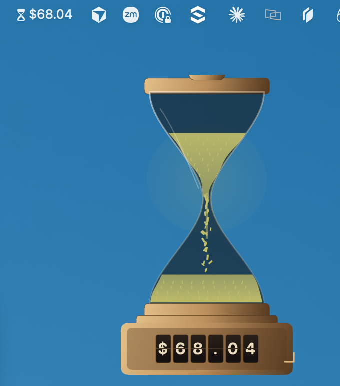

# Tokenrash



Floating macOS hourglass overlay that shows **remaining daily token budget in USD**.

It does **not** parse local Claude/Codex logs. It reads Lightricks tokendash after Google IAP sign-in:

- Page: `https://tokendash-backend-api-olut5dffgq-ew.a.run.app/me` (HTML SPA)
- Live numbers: JSON that SPA fetches (`today.spend_usd` vs `today.effective_limit_usd` / `standing_limit_usd`)
- Remaining = `limit − spend` (example: `$17.64` spent of `$100.00` → plate shows `$82.36`)

Repo: https://github.com/harelc/tokenrash (private)

---

## Agent quickstart

Copy-paste. Do not use `swift package`, `swift build`, or `xcodebuild` (see [Why not SPM / Xcode](#why-not-spm--xcode)).

```bash
# 0. Preflight (must all succeed)
uname -m                                          # expect arm64
sw_vers -productVersion                            # expect 14.0+
xcode-select -p                                    # often /Library/Developer/CommandLineTools
xcrun --show-sdk-path                              # must print an SDK path
swiftc --version | head -1
test -x scripts/run.sh && echo "run.sh ok"

# 1. Build + launch
chmod +x scripts/run.sh
./scripts/run.sh
# success line: Launched /…/tokenrash/dist/Tokenrash.app

# 2. Confirm process
pgrep -lf Tokenrash.app/Contents/MacOS/Tokenrash
```

**Done when:** `dist/Tokenrash.app` exists, process is running, menu bar shows an hourglass, overlay is on screen (may be on a secondary display). First run uses demo sand until Google IAP sign-in.

Do **not** commit `dist/` or `.build/`.

---

## Requirements

| Need | Notes |
| --- | --- |
| macOS 14+ | `LSMinimumSystemVersion` and `-target arm64-apple-macos14.0` |
| Apple silicon | Build is **arm64 only**. No Intel slice. |
| Xcode Command Line Tools | Full Xcode.app is **not** required and often **not** installed. |
| Network | HTTPS to `tokendash-backend-api-olut5dffgq-ew.a.run.app` after sign-in |
| Google account | Lightricks IAP (`@lightricks.com`). `gcloud auth` **cannot** call this API (JWT audience). |

Install CLT if `xcrun --show-sdk-path` fails:

```bash
xcode-select --install
```

If `xcodebuild` errors with “requires Xcode, but active developer directory is Command Line Tools”, that is expected. Keep using `swiftc` + `scripts/run.sh`.

---

## Install from git

```bash
git clone https://github.com/harelc/tokenrash.git
cd tokenrash
chmod +x scripts/run.sh
./scripts/run.sh
```

There is no Homebrew formula, no App Store build, no notarized DMG. Each machine compiles locally. After first launch, macOS may need:

```bash
xattr -dr com.apple.quarantine dist/Tokenrash.app   # only if Gatekeeper blocks open
```

The script ad-hoc signs: `codesign --force --deep -s - dist/Tokenrash.app`.

To run an already-built app without rebuilding:

```bash
open dist/Tokenrash.app
```

`scripts/run.sh` **kills** any existing `Tokenrash.app` process first, then rebuilds.

---

## Build (what the script actually does)

Canonical entrypoint: [`scripts/run.sh`](scripts/run.sh). Agents should call that, not invent a new compile line, unless changing the build itself.

Equivalent steps:

```bash
ROOT="$(pwd)"
SDK="$(xcrun --show-sdk-path)"
APP="$ROOT/dist/Tokenrash.app"

pkill -f "/Tokenrash.app/Contents/MacOS/Tokenrash" || true
rm -rf "$APP"
mkdir -p "$APP/Contents/MacOS" "$APP/Contents/Resources"

swiftc -parse-as-library \
  -O \
  -o "$APP/Contents/MacOS/Tokenrash" \
  -sdk "$SDK" \
  -target arm64-apple-macos14.0 \
  -framework SwiftUI -framework AppKit -framework WebKit \
  "$ROOT"/Sources/Tokenrash/*.swift

cp "$ROOT/Resources/Info.plist" "$APP/Contents/Info.plist"
chmod +x "$APP/Contents/MacOS/Tokenrash"
codesign --force --deep -s - "$APP" || true
open "$APP"
```

### Flags that matter

| Flag | Why |
| --- | --- |
| `-parse-as-library` | Required for `@main` in `App.swift`. Without it, `swiftc` looks for `main()`. |
| `-framework SwiftUI -framework AppKit -framework WebKit` | Overlay + IAP `WKWebView`. Missing WebKit → link failure. |
| `-target arm64-apple-macos14.0` | Matches Info.plist minimum. Do not retarget to Intel unless you add a second slice. |
| Compile `Sources/Tokenrash/*.swift` | Flat module, no folders. New `.swift` files in that directory are picked up automatically. |
| Copy `Resources/Info.plist` into the bundle | `LSUIElement=true` (no Dock icon). Running the raw binary without a bundle is wrong. |

### Compile-only (no launch)

```bash
SDK="$(xcrun --show-sdk-path)"
swiftc -parse-as-library -O \
  -o /tmp/Tokenrash-bin \
  -sdk "$SDK" \
  -target arm64-apple-macos14.0 \
  -framework SwiftUI -framework AppKit -framework WebKit \
  Sources/Tokenrash/*.swift
```

Exit 0 = sources compile. Then still wrap with Info.plist before `open`.

---

## Why not SPM / Xcode

[`Package.swift`](Package.swift) exists as documentation of the target layout. **Do not use it to build on this machine class.**

On Command Line Tools (no `Xcode.app`), `swift build` fails while linking `PackageDescription` (`Undefined symbols … Package.__allocating_init`). `xcodebuild` refuses to run against CLT.

If a future agent has full Xcode and `swift build` starts working, `scripts/run.sh` must still remain the default so CLT-only contributors can build.

---

## Layout

```
tokenrash/
  scripts/run.sh                 # ONLY supported build+launch
  Sources/Tokenrash/*.swift      # entire app; compile all files
    App.swift                    # @main, menu bar, overlay NSPanel
    OverlayView.swift            # plate layout
    HourglassView.swift          # sand clock canvas
    SplitFlapBoard.swift         # remaining USD tiles
    ResizeHandleView.swift       # bottom-right AppKit resize grip
    IAPSession.swift             # WKWebView IAP + fetch sniffer
    TokenBudget.swift            # parse today.spend_usd / limits
    BudgetStore.swift            # @Observable UI state
    Config.swift                 # API origin + poll interval
  Resources/Info.plist           # bundle id com.harel.tokenrash, LSUIElement
  Package.swift                  # unused for build (see above)
  dist/Tokenrash.app             # gitignored output
```

Bundle id: `com.harel.tokenrash`. Changing it orphans cookies and UserDefaults.

---

## Runtime (for agents debugging “it launched but shows demo sand”)

1. `/me` is **HTML** (Vite SPA), not JSON. Do not `JSON.parse` the document.
2. Auth is **Google IAP in WKWebView**. `gcloud auth print-identity-token` returns 401 `Invalid JWT audience`. Do not spend time on gcloud audiences unless using a service account.
3. IAP cookies live in **WebKit’s store**, not `URLSession`’s. After login, a hidden WKWebView loads `/me`, a document-start script sniffs `fetch`/`XHR` JSON, and `TokenBudgetParser` prefers:

   ```json
   {
     "today": {
       "spend_usd": "17.64",
       "effective_limit_usd": "100.00",
       "standing_limit_usd": "100.00"
     }
   }
   ```

   Remaining displayed = `effective_limit_usd − spend_usd`.

4. Debug dumps (not secrets-safe; may include email):

   - `~/Library/Logs/Tokenrash-last-me.json`
   - `~/Library/Logs/Tokenrash-captures.jsonl`

5. Overlay frame: UserDefaults key `overlay.frame.v2`. Menu **Reset size** → 200×300. Drag the brass corner grip to resize (2:3 aspect).

6. Right-click menu bar hourglass: Sign in / Refresh now, Inspect `/me` payload, Click through, Reset size, Quit. **Refresh now** reloads in the hidden WebView (no login window unless Google IAP asks again).

---

## Verify a change

After any Swift edit:

```bash
./scripts/run.sh
pgrep -lf Tokenrash.app/Contents/MacOS/Tokenrash
```

Then:

- Overlay visible; plate is currency with cents (`$82.36`), not a token compact form (`82K`).
- Sand color tracks **remaining** fraction (green-gold when plenty left, ember when low).
- Sign-in still uses the in-app WebView, not Safari-only (cookies would not transfer).

There is no unit test target. Parser changes should be checked against a captured `today` object in `Tokenrash-captures.jsonl` or Inspect payload.

---

## Common failures

| Symptom | Likely cause | Fix |
| --- | --- | --- |
| `swift build` PackageDescription undefined symbols | CLT-only SwiftPM | Use `scripts/run.sh` |
| `xcodebuild` / “requires Xcode” | No `Xcode.app` | Ignore; use `swiftc` |
| `error: no exact matches in call to instance method 'draw'` | `Text` modifiers that yield `some View` | Draw `Text` with only `.font` / `.foregroundColor` |
| App launches, no Dock icon | Intended (`LSUIElement`) | Look at **menu bar** |
| Overlay missing | Other display / saved frame | Menu → Reset size; check negative `CGWindow` X |
| Demo sand after browser login | `/me` HTML not sniffed JSON | Inspect payload; confirm captures jsonl has `"today"` |
| Gatekeeper block | Unsigned download | `xattr -dr com.apple.quarantine dist/Tokenrash.app` |

---

## Constraints for coding agents

- Prefer editing existing files under `Sources/Tokenrash/`. New Swift files in that folder are compiled automatically; subdirectories are not.
- Do not add SPM dependencies, CocoaPods, or an `.xcodeproj` unless the user asks and full Xcode is present.
- Do not sandbox the app unless you also add `com.apple.security.network.client` and a real signing identity.
- Do not log IAP cookie values.
- Keep `scripts/run.sh` working: ad-hoc `swiftc` of `*.swift` into `dist/Tokenrash.app`.
